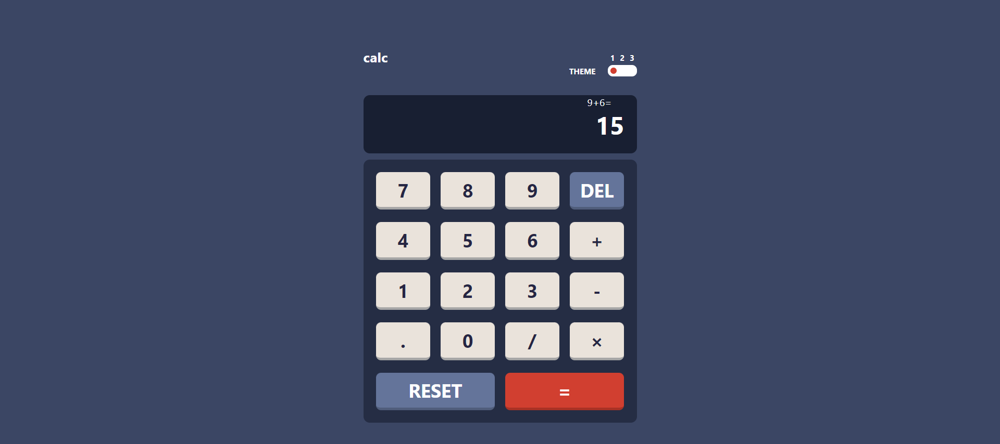
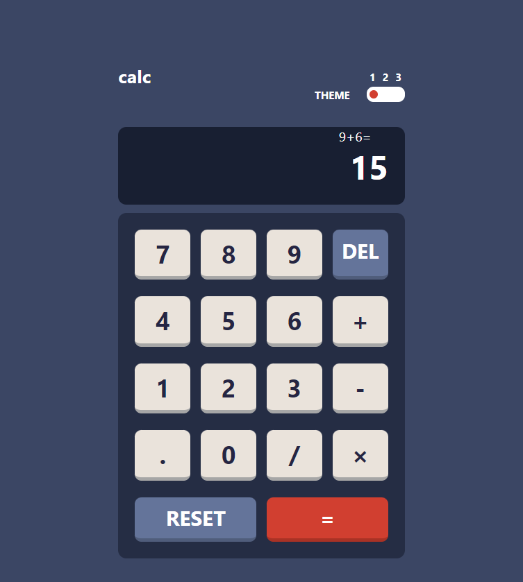
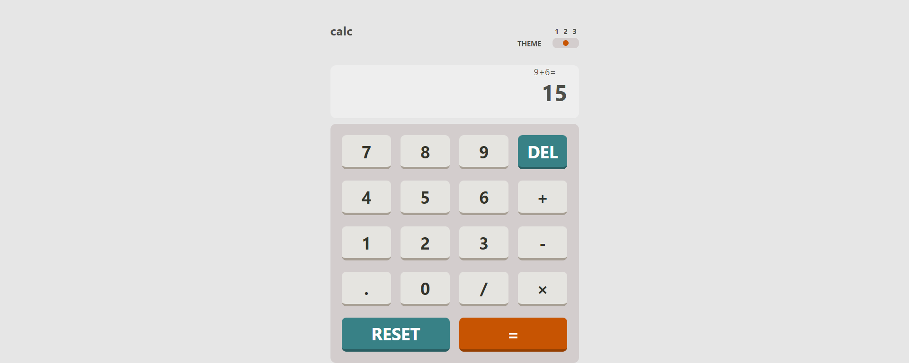
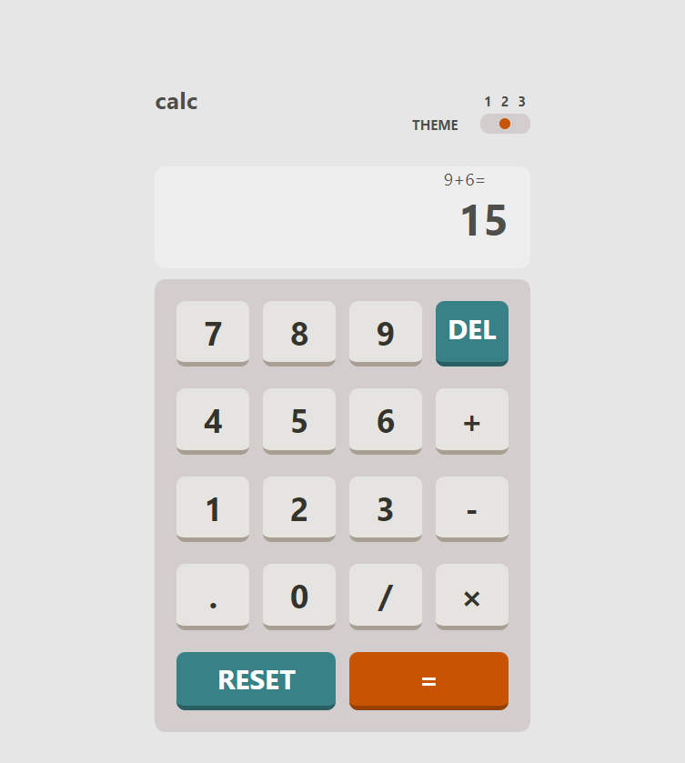
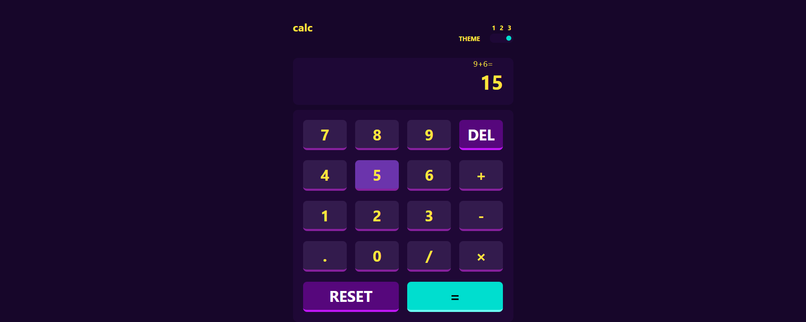
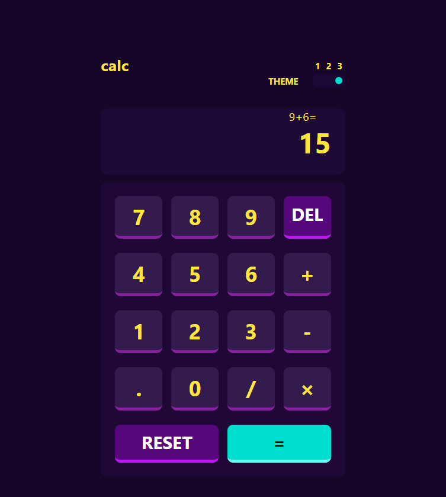

# Frontend Mentor - Calculator app solution

This is a solution to the [Calculator app challenge on Frontend Mentor](https://www.frontendmentor.io/challenges/calculator-app-9lteq5N29).

## Table of contents

- [Overview](#overview)
- [The challenge](#the-challenge)
- [Screenshot](#screenshot)
- [Links](#links)
- [My process](#my-process)
- [Built with](#built-with)
- [What I learned](#what-i-learned)
- [Useful resources](#useful-resources)
- [Author](#author)

## Overview

This is a calculator web app built with HTML, CSS, SASS and JavaScript. It can perform basic calculations like addition, subtraction, multiplication and division.

### The challenge

Users should be able to:

- See the size of the elements adjust based on their device's screen size
- Perform mathmatical operations like addition, subtraction, multiplication, and division
- Adjust the color theme based on their preference

### Screenshot

### Links

- Solution URL: https://github.com/tomjames156/calculator_app)
- Live Site URL: https://calulator-app.netlify.app/)

## My process

- I coded the layout (HTML) and added styling (CSS) simultaneously. 
- I made use of SASS to make the styles for different themes
- I added the logic using JavaScript

### Built with

- Semantic HTML5 markup
- CSS custom properties
- SASS CSS preprocessor
- Flexbox
- CSS Grid
- Desktop-first workflow

### What I learned

I learnt about asynchronous functions which i used to make sure to get the calcuation result before displaying the result. I also made use of the try and except syntax to handle errors in case a user enters an unwanted data type.

### Useful resources

(https://www.w3schools.com/)
(https://stackoverflow.com/questions/10286386/how-to-convert-string-equation-to-number-in-javascript)

## Author

- Website - [Akinwande Tomisin](https://tomis-portfolio.netlify.app)
- Github - [@tomjames156](https://github.com/tomjames156)
- Frontend Mentor - [@tomjames156](https://www.frontendmentor.io/profile/tomjames156)
- Twitter - [@tomisnakinwande](https://mobile.twitter.com/tomisnakinwande/)